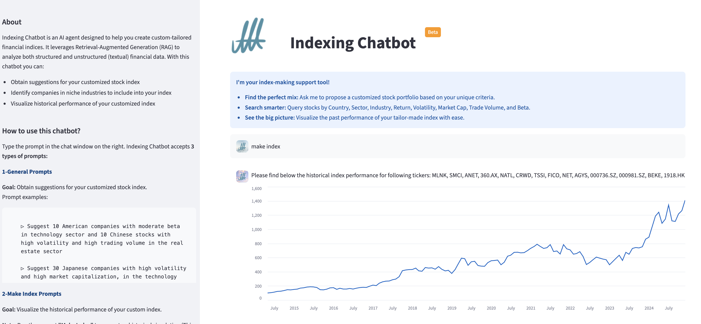
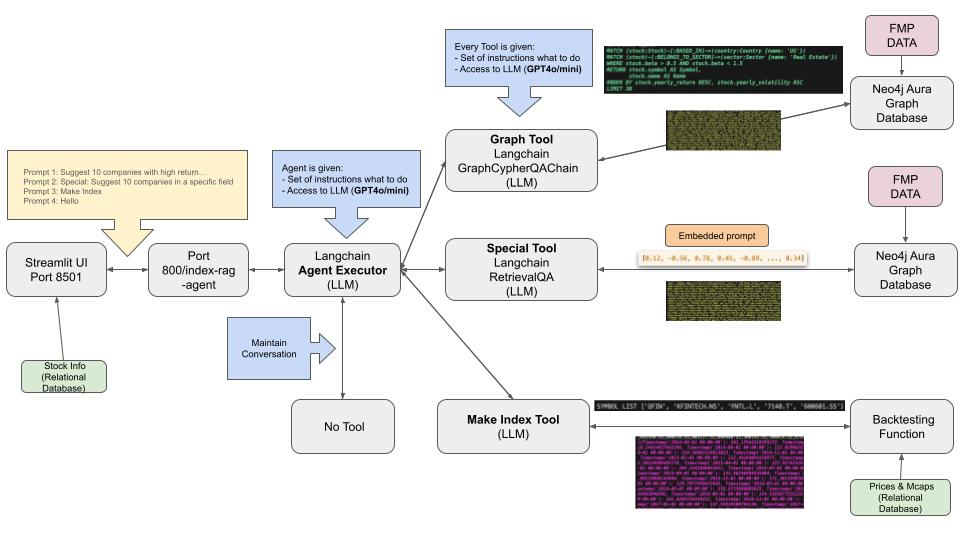

# Index Maker RAG




Index Maker is a Retrieval-Augmented Generation (RAG) system that helps you discover companies and build static indices (custom portfolios) from natural‑language prompts. It combines:
- A FastAPI backend that orchestrates an LLM Agent with multiple tools
- A Neo4j graph database for structured financial data search
- A Streamlit frontend for a simple chat UX and index visualization


## Architecture

High-level flow:
1. User sends a prompt to the FastAPI endpoint.
2. The LLM Agent selects one of three tools based on the prompt:
   - Graph: generate and run a Cypher query against Neo4j and return results.
   - Special: run a semantic search chain over company descriptions (triggered only if prompt starts with “special:”).
   - Index: build a market-cap-weighted index time series from the most recent set of tickers.
3. The Streamlit app displays results (tables or index time series) and guides the user on next steps.





## Components

- Backend (FastAPI): `chatbot_api/src/main.py`
  - Endpoints:
    - GET `/` → health/status
    - POST `/index-rag-agent` → main chat/agent endpoint
  - Agent and tools:
    - Agent: `chatbot_api/src/agents/index_rag_agent.py`
    - Graph tool (Neo4j): `chatbot_api/src/chains/index_cypher_chain.py`
    - Special tool (Descriptions): `chatbot_api/src/chains/index_description_chain.py`
    - Index tool: `index_maker/index_maker.py` (`make_index_tool`)

- Frontend (Streamlit): `chatbot_frontend/main.py`
  - Talks to the FastAPI endpoint
  - Shows guidance in the left panel and results in the right panel


## Data

- This project does not run a recurrent ETL pipeline.
- Raw data was downloaded from the FMP financial data provider and stored as a SQLite database (`stocks_data.db`).
- Data was cleaned/processed and stored in pickle files under `files/` for convenience.
- Processed data from pickle was uploaded into a Neo4j Graph database, which powers the RAG queries.
- see Data prep (Notebooks): `data_prep/`
  - `1_data_load_to_sqlite.ipynb`
  - `2_data_transform.ipynb`
  - `3_data_load_to_graph_db.ipynb`


Artifacts in repo:
- `.db` file: SQLite database with FMP data (`stocks_data.db`).
- `.pkl` files: can be recreated by running the notebooks in `data_prep/`.


## Environment Variables

Create a `.env` in the project root (same level as this README) with at least:

- OPENAI_API_KEY=<your key>
- NEO4J_URI=bolt+s://<host>:<port>
- NEO4J_USERNAME=<username>
- NEO4J_PASSWORD=<password>

Optional/advanced (defaults are set dynamically in code when appropriate):
- INDEX_AGENT_MODEL (agent LLM, e.g. `gpt-4o-mini`)
- INDEX_QA_MODEL (QA LLM for query answers, e.g. `gpt-4o-mini`)
- INDEX_CYPHER_MODEL (LLM for Cypher generation, e.g. `gpt-4o-mini`)
- CHATBOT_URL (used by Streamlit frontend; default `http://localhost:8080/index-rag-agent`)
- TICKERS (comma-separated tickers; used by Index tool when prompt doesn’t specify tickers)

Note on TICKERS:
- When you run a Graph or Special query, the backend extracts tickers from the agent’s intermediate steps and persists them to `.env` (TICKERS). If you later run “Make Index” without specifying tickers, the Index tool will use the latest saved TICKERS.


## Setup

Requires Python 3.11 and Poetry.

1) Create and activate a virtual environment:

```bash
python -m venv .venv
source .venv/bin/activate
```

2) Install dependencies:

```bash
poetry install
```

3) Ensure Neo4j is running and accessible with the credentials in `.env`.

4) Generate data by running the scripts form the data_prep

5) Run the application


## Running

Backend (FastAPI/Uvicorn):

```bash
make uvi         # starts FastAPI on :8080
# or
make uvi_reload  # starts with --reload
```

Frontend (Streamlit):

```bash
make st
# This runs Streamlit on :8501 with a base URL path of /demo-apps/index-maker-rag
```


## API

- Health
  - GET `/`
  - Response: `{"status": "running"}`

- Chat/Agent
  - POST `/index-rag-agent`
  - Request body:

```json
{
  "text": "Suggest 10 American companies with moderate beta in technology sector"
}
```

  - Response body (Pydantic model `IndexQueryOutput`):

```json
{
  "input": "string",
  "output": "string or object depending on tool",
  "intermediate_steps": ["... agent/tool trace ..."],
  "result": "optional parsed result for frontend",
  "tickers": ["AAPL", "MSFT"],
  "memory": [{"user": "...", "agent": "..."}]
}
```

Notes on tools:
- Graph tool
  - Generates a Cypher query (with `INDEX_CYPHER_MODEL`), executes it on Neo4j, and summarizes the results (with `INDEX_QA_MODEL`).
  - Defaults (coded in `index_cypher_chain.py`) include reasonable limits and filters.
- Special tool
  - Triggered only if the prompt starts with the word “special” (case-insensitive).
  - Runs a semantic retrieval chain over descriptions and returns a formatted list:
    - `**<Company Name>** (Symbol: <Symbol>) - <Summary>`
- Index tool
  - Builds a market-cap-weighted historical index time series from tickers (either from prompt or latest saved `TICKERS` in `.env`).
  - The Streamlit app will render this time series.


## Frontend UX (Streamlit)

- Left panel explains how to use the chatbot:
  - General prompts → Graph tool
  - “Make Index …” → Index tool (uses prompt tickers or TICKERS from `.env`)
  - “Special: …” → Special tool
- Implementation details shown in the app (mirrored here):
  - Data covers ~14k high‑volume stocks globally
  - Available structured fields: country, sector, industry, exchange, average return, volatility, market cap, trading volume, beta
  - Index calculation uses EUR, starts at 100, rebalanced every 6 months
  - Returns/volatility are annualized over the last 5 years
  - Current limitations: only market‑cap weighting; fixed start date; no corporate actions/dividends; suggestions limited to 30


## License

Proprietary. All rights reserved.


